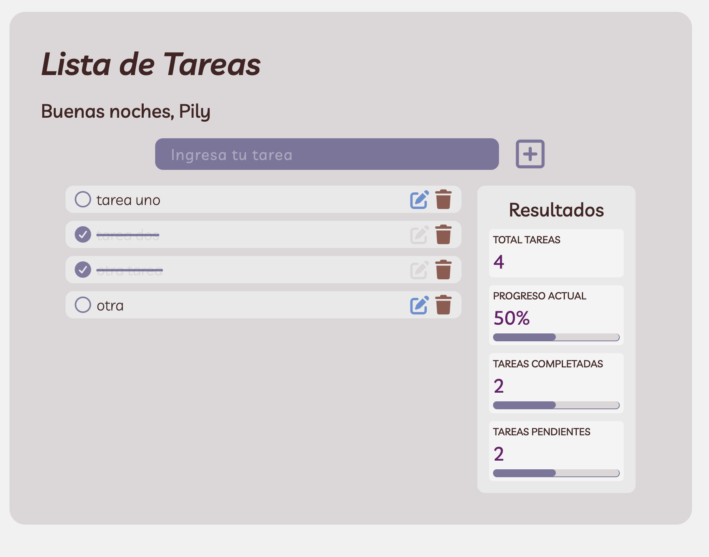

# Master App: Lista de Tareas Modulares

## Referencia:

Inspirado en prácticas de desarrollo modular con JavaScript Vanilla.

## Descripción:

Aplicación modular para la gestión de tareas diarias con panel de estadísticas en tiempo real, persistencia de datos y saludo dinámico.

### Funcionalidades principales:

1. **CRUD Completo:** Crear, marcar como completada, editar y eliminar tareas.
2. **Persistencia de Datos:** Guardado automático en `localStorage`.
3. **Estado Inicial Dinámico (_Empty State_):** Muestra una ilustración y mensaje representativo cuando no existen tareas pendientes.
4. **Panel de Resultados y Estadísticas:**
   - Contador de total de tareas, completadas y pendientes.
   - Barras de progreso con cálculo dinámico de porcentajes.
5. **Saludo Personalizado:** Mensaje dinámico en el encabezado (_Buenos días_, _Buenas tardes_, _Buenas noches_) según la hora del sistema.
6. **Controles de UI:** Bloqueo automático del botón de edición para tareas completadas y feedback visual al momento de editar.

---

## Estructura del Proyecto:

Se aplicó el principio de **"una sola responsabilidad por archivo"** mediante módulos ES6 (`type="module"`):

```text
/
├── index.html
├── style.css
├── README.md
└── src/
    ├── js/
    │   ├── storage.js    # Manejo exclusivo de localStorage (get/save)
    |   ├── greeting.js   # Saludo personalizado según la hora
    │   ├── ui.js         # Renderizado del DOM (lista de tareas, empty state, estadísticas y saludo)
    │   ├── app.js        # Lógica del CRUD, filtrado y cálculo de datos de estado
    │   └── main.js       # Coordinador general de eventos y flujo de ejecución
    └── assets/
        └── empty-state.png
```

## Notas de Desarrollo & Aprendizajes:

1. Delegación de Eventos para Submit: Se implementó un escuchador global de submit en el contenedor .tasks dentro de main.js. Esto eliminó la acumulación de listeners dinámicos sobre los formularios de edición individual, manteniendo el código limpio y eficiente.
2. Arquitectura Desacoplada (app.js vs ui.js): La función getStates() en app.js calcula los contadores y porcentajes devolviendo un objeto puro con los datos. Luego, printStates() en ui.js consume dicho objeto únicamente para actualizar elementos del DOM y estilos de ancho (width) en CSS.
3. Manejo de Casos Límite (Guardias): Se previno la generación de valores NaN% en las barras de progreso cuando el total de tareas es cero (total > 0).
4. Estandarización con dataset.id: Se simplificó la búsqueda de referencias en el array leyendo el data-id mediante e.target.closest(".task").

## Imagen final de referencia


