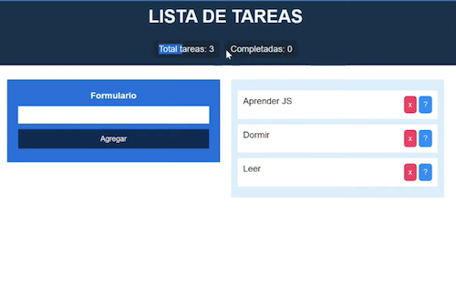
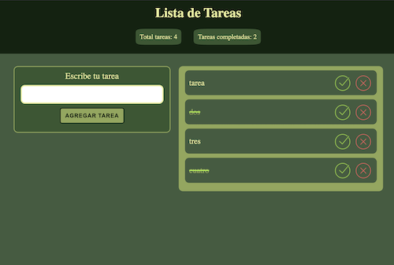

# App Lista de Tareas

## Canal: Alejandro Nes Web

## Video:

[Aquí puedes ver el tutorial (Youtube)](https://www.youtube.com/watch?v=3mTMDG2mkwU)

## Descripción:

Es una aplicación básica de lista de tareas. Su funcionalidad consiste en:

1. Agregar una tarea.
2. Marcarla como realizada.
3. Eliminarla.

### Funcionalidad adicional interesante:

1. _*Contador para el total de las tareas y las tareas completadas*_

> **Nota:** Esta aplicación no tiene persistencia en el localStorage
> Recuerda agregarla luego.

> Esta es una imagen de referencia inicial:



## Notas de Desarrollo:

- Al utilizar un `dataset-id` en los botones `completar`y `eliminar` y asignar ahí el `id`
  no hubo necesidad de subir hasta el `li` para encontrarlo.
- Usamos `form.reset()`para limpiar el input, en lugar de `input.value="`
- En la función `printTasks()` el return que había dentro del if

```javascript
if (tasks.length === 0) {
  containerTasks.append(initialMsg);
  return;
}
```

generaba un bug en la función `updateTasksStatus()`: cuando el array estaba vacío hacía
el return antes obtener esos datos y el status quedaba con valor de 1.
Por eso se eliminó ese `return`

- Se implementó la función `handlerClickTasks(e)` para manejar las funciones `completeTask()`y `deleteTask()`.
  De esa forma el evento quedó más limpio.

> Esta es una imagen de referencia final:


