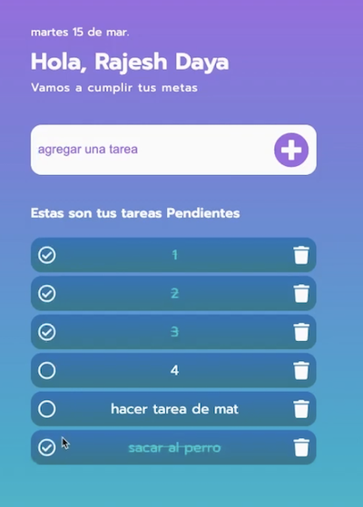
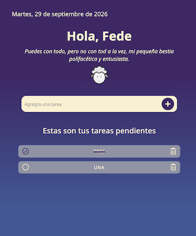

## Canal: The Dev Code

### Video:

[Aquí puedes ver el tutorial (Youtube)](https://www.youtube.com/watch?v=9N7iuyYnqpg)

### Descripción:

Es una aplicación básica de lista de tareas. Su funcionalidad consiste en:

1. Agregar una tarea.
2. Marcarla como realizada.
3. Eliminarla.

Una característica adicional interesante es **_agregar la fecha actual_**.
Además tiene persistencia en local storage.

> Esta es una imagen de referencia inicial:

### Notas de Desarrollo:

- Para modificar el tamaño de los íconos de fontawesome el width no sirve,
  debes usar font-size.
- los `li` de cada tarea se están creando con `insertAdjacentHTML`
  que recibe dos parámetros: `posición` y `elemento de referencia`.
- Se usa `toggle`para gestionar las clases `classCheck, classUncheck` y `classCompleted`
  que modifican la interfaz de acuerdo a la interacción del usuario.
- la función de fecha se hace con `toLocaleDateString()`que recibe dos parámetros:  
  `idioma (String)` y `formato (Object)`.

### Aspectos por mejorar en este proyecto

1. El manejo del localStorage no se ve limpio
2. Establecer el id con el index del array no es conveniente
3. Aunque las tareas eliminadas no llegan a renderizarse, sí se añaden al array, lo que lo hace crecer indiscriminadamente.
4. Cuando no hay tareas, el mensaje del contenedor debería ser otro.

> Esta es una imagen de referencia final:

