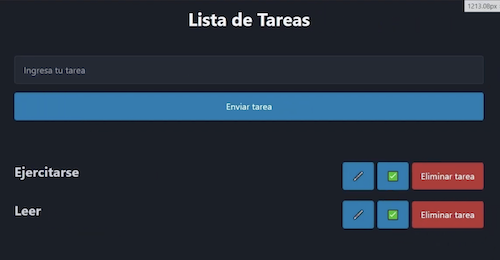
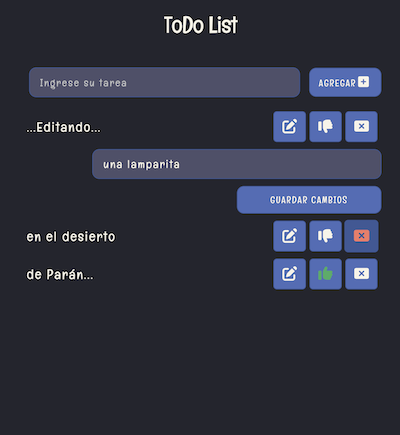

# App Lista de Tareas

## Canal: rocoDev

## Video:

[Aquí puedes ver el tutorial (Youtube)](https://www.youtube.com/watch?v=GmUK-hYzGMA)

## Descripción:

Es una aplicación básica de lista de tareas. Su funcionalidad consiste en:

1. Agregar una tarea.
2. Marcarla como realizada.
3. Editarla
4. Eliminarla.

Además tiene persistencia en local storage.

> Esta es una imagen de referencia inicial:



## Notas de Desarrollo:

- Cada tarea es un objeto:

```javascript
const task = {
  value: input.value,
  done: false,
  id: crypto.randomUUID(),
};
```

- El uso de `localStorage`está un poco más limpio.

## Aspectos por mejorar en este proyecto

1. La tarea para renderizar se está creando con innerHTML y no es la mejor opción.
2. Las funciones `showFormEditTask`, `updateTask`, `completedTask`y `deleteTask` están obteniendo datos de forma repetitiva y realizando algunas acciones iguales.
3. El `listener`del documento se puede mejorar haciendo una función `handler`y retirando el código de allí.

> Esta es una imagen de referencia final:


